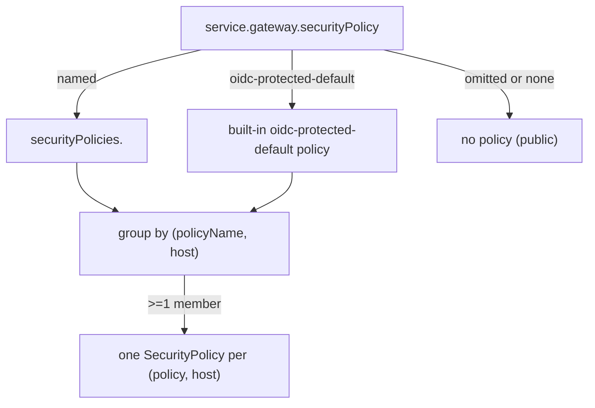

# Proposal: named SecurityPolicies

This is a design proposal for review. It is not implemented in this branch. It builds on the shared-session work in [PR #549](https://github.com/chanzuckerberg/argo-helm-charts/pull/549) and proposes replacing the automatic host-based grouping with named policies that services reference by name.

This is a breaking, greenfield cutover. The gateway OIDC feature is new and thinly adopted, so the per-service settings are removed outright rather than deprecated behind a compatibility shim.

## Problem

A `SecurityPolicy` holds one `oidc`, `cors`, `ipAllowList`, `basicAuth` and `jwt` block, and an `HTTPRoute` can attach to only one `SecurityPolicy`. So any set of services that share a session must share one policy, and therefore one set of those settings. There is no per-path override inside a policy.

The current model derives which services share a policy automatically from their hostname, then reconciles their per-service settings after the fact. That reconciliation is where the sharp edges are. It takes annotations from one service and drops the rest, it suppresses a grouped service's `rules` and `-public` policies, and it fails the render when two services on one host want different OIDC providers, which is a configuration the old per-service model supported.

## Model

Move the policy settings out of each service into named policy definitions declared once, and have each service name the policy it wants. Every service pointing at the same policy becomes a `targetRef` on one object, so sharing is explicit and there is nothing to merge or clobber.

A policy is realized per hostname, because its `redirectURL` and OauthHMAC cookie are host-scoped. One named policy referenced by services on two hosts renders as two `SecurityPolicy` objects, one per host, each targeting that host's routes.



## New values surface

- Remove the top-level `oidcProxyGateway` block and the `gateway.cors`, `gateway.ipAllowList`, `gateway.basicAuth`, `gateway.jwt` and `gateway.oidcProtected` fields. The gateway block keeps only route-shaped fields such as `host`, `paths`, `rules`, `vanity`, `timeouts`, headers and `tlsPassthrough`.
- A global-only `securityPolicies:` map, one entry per named policy, each carrying `oidc` (the former `oidcProxyGateway` fields), `basicAuth`, `jwt`, `cors`, `ipAllowList` and `annotations`. It is not under the `services` `$ref`, so it cannot be set per service.
- A `gateway.securityPolicy: ""` string on the service shape. Its value is a policy name, `oidc-protected-default` or `none`. The empty value means `none`, so a gateway service is public unless it names a policy. There is no protected-by-default. Naming a policy is the only opt-in, which matches today's `oidcProtected: false` default and keeps public sites and machine APIs public on upgrade.
- A built-in `oidc-protected-default` policy is synthesized when `securityPolicies.oidc-protected-default` is absent, using `argus-global-oidc`, issuer `https://czi.okta.com`, the current default scopes, `denyRedirect: true` and `logoutPath: /logout`. So `gateway.securityPolicy: oidc-protected-default` is zero-config.

## Resolution and rendering

- `securityPolicy.definitions` returns the declared map with the built-in `oidc-protected-default` merged in.
- `securityPolicy.resolve` returns a service's effective policy name and settings. It uses the explicit `gateway.securityPolicy` name. When that is omitted or `none`, the service gets no policy and is public. There is no legacy branch and no protected-by-default.
- `gateway.securityPolicy.body` is refactored to take a resolved policy dict instead of reading `oidcProxyGateway` and `gateway.cors`/`...` off the service. This is the core decoupling.
- The host-only grouping from PR #549 becomes grouping by `(policyName, host)`.
- Default cookie names for a policy derive from `(policyName, host)`, not a service name, so the session is stable regardless of membership.

## What this fixes

- Two services on different policies on one host render two policies. The two-provider case works instead of failing.
- A grouped service keeps its `rules` and `-public` skipAuth policies, because only its main policy is folded into the shared object.
- Annotations come from the policy definition, so nothing is dropped.
- The config-equality failure is gone, because settings are centralized and there is nothing to disagree on.

## Example values

A public service. With `securityPolicy` omitted, no `SecurityPolicy` is rendered and the route stays public, the same as `securityPolicy: none`:

```yaml
services:
  public-site:
    gateway:
      host: www.example.com
      paths:
        - path: /
          pathType: Prefix
```

Zero-config protection with the built-in `oidc-protected-default` policy:

```yaml
services:
  app:
    gateway:
      securityPolicy: oidc-protected-default
      host: app.example.com
      paths:
        - path: /
          pathType: Prefix
```

A SPA and its API sharing one session on one host. Both name `oidc-protected-default`, so both routes land under one policy and one cookie:

```yaml
services:
  frontend:
    gateway:
      securityPolicy: oidc-protected-default
      host: app.example.com
      paths:
        - path: /
          pathType: Prefix
  backend:
    gateway:
      securityPolicy: oidc-protected-default
      host: app.example.com
      paths:
        - path: /api
          pathType: Prefix
```

Two OIDC providers on one host, the case that fails today. A second named policy runs its own Okta client, and the two render as separate policies:

```yaml
securityPolicies:
  admin-okta:
    oidc:
      clientSecretName: admin-okta-client
      provider:
        issuer: https://czi.okta.com
      scopes: [openid, profile, email, groups]
    cors:
      enabled: true
      allowOrigins: ["https://app.example.com"]

services:
  app:
    gateway:
      securityPolicy: oidc-protected-default
      host: app.example.com
      paths:
        - path: /
          pathType: Prefix
  admin:
    gateway:
      securityPolicy: admin-okta
      host: app.example.com
      paths:
        - path: /admin
          pathType: Prefix
```

A full policy definition, showing the `oidc` block that carries the former `oidcProxyGateway` fields, plus a public service that opts out:

```yaml
securityPolicies:
  data-portal:
    oidc:
      clientSecretName: ""            # empty uses globalSecretName
      globalSecretName: argus-global-oidc
      provider:
        issuer: https://czi.okta.com
      scopes: [openid, profile, email, groups]
      logoutPath: /logout
      denyRedirect:
        enabled: true
      skipAuth:
        - path: /healthz
          method: GET
      apiRoutes:
        - path: /api
          matchType: Prefix
    ipAllowList: []
    annotations:
      team: data-platform
    jwt:
      enabled: false

services:
  portal:
    gateway:
      securityPolicy: data-portal
      host: portal.example.com
      paths:
        - path: /
          pathType: Prefix
  public-api:
    gateway:
      securityPolicy: none
      host: api.example.com
      paths:
        - path: /
          pathType: Prefix
```

## Example tests

These are illustrative `helm unittest` cases against the folded renderer. The policy object name `release-name-stack-oidc-protected-default` assumes the proposed `<release>-stack-<policyName>` scheme.

```yaml
- it: should render the built-in policy for a protected service with no securityPolicies declared
  set:
    global:
      ingress: {enabled: false}
      gateway: {enabled: true, host: app.example.com}
    services:
      app:
        gateway:
          securityPolicy: oidc-protected-default
          paths: [{path: /, pathType: Prefix}]
  asserts:
    - hasDocuments: {count: 1}
    - equal: {path: metadata.name, value: release-name-stack-oidc-protected-default}
    - equal: {path: spec.oidc.redirectURL, value: https://app.example.com/oauth2/callback}
    - lengthEqual: {path: spec.targetRefs, count: 1}

- it: should render no SecurityPolicy when securityPolicy is omitted
  set:
    global:
      ingress: {enabled: false}
      gateway: {enabled: true, host: www.example.com}
    services:
      public-site:
        gateway: {paths: [{path: /, pathType: Prefix}]}
  asserts:
    - hasDocuments: {count: 0}

- it: should cover both services with one policy when they share a named policy on one host
  set:
    global:
      ingress: {enabled: false}
      gateway: {enabled: true, host: app.example.com}
    services:
      frontend:
        gateway: {securityPolicy: oidc-protected-default, paths: [{path: /, pathType: Prefix}]}
      backend:
        gateway: {securityPolicy: oidc-protected-default, paths: [{path: /api, pathType: Prefix}]}
  asserts:
    - hasDocuments: {count: 1}
    - lengthEqual: {path: spec.targetRefs, count: 2}

- it: should render one policy per named policy when two providers share a host
  set:
    global:
      ingress: {enabled: false}
      gateway: {enabled: true, host: app.example.com}
    securityPolicies:
      admin-okta:
        oidc:
          clientSecretName: admin-okta-client
          provider: {issuer: https://czi.okta.com}
    services:
      app:
        gateway: {securityPolicy: oidc-protected-default, paths: [{path: /, pathType: Prefix}]}
      admin:
        gateway: {securityPolicy: admin-okta, paths: [{path: /admin, pathType: Prefix}]}
  asserts:
    - hasDocuments: {count: 2}

- it: should take annotations from the policy definition onto the shared policy
  set:
    global:
      ingress: {enabled: false}
      gateway: {enabled: true, host: app.example.com}
    securityPolicies:
      oidc-protected-default:
        annotations: {team: platform}
    services:
      frontend: {gateway: {securityPolicy: oidc-protected-default, paths: [{path: /, pathType: Prefix}]}}
      backend: {gateway: {securityPolicy: oidc-protected-default, paths: [{path: /api, pathType: Prefix}]}}
  asserts:
    - equal: {path: metadata.annotations.team, value: platform}

- it: should render no SecurityPolicy for a service that opts out
  set:
    global:
      ingress: {enabled: false}
      gateway: {enabled: true, host: api.example.com}
    services:
      public-api:
        gateway: {securityPolicy: none, paths: [{path: /, pathType: Prefix}]}
  asserts:
    - hasDocuments: {count: 0}
```

## Breaking change and scope

Every stack using the gateway OIDC feature must move its `oidcProxyGateway`/`cors`/`ipAllowList`/`basicAuth`/`jwt`/`oidcProtected` values into a `securityPolicies` entry and reference it with `gateway.securityPolicy`. `Chart.yaml` goes to 3.0.0.

Ingress-based OIDC is a separate mechanism and is not affected. `oidc_proxy.yaml` is driven by `ingress.oidcProtected` and does not read `oidcProxyGateway`.

## Open questions

- Policy object naming should be deterministic and stable, for example `<release>-stack-<policyName>`, so a later rename does not delete and recreate live policies.
- Basing default cookie names on `(policyName, host)` is intended. Since the feature is thinly adopted there is little live session churn.
