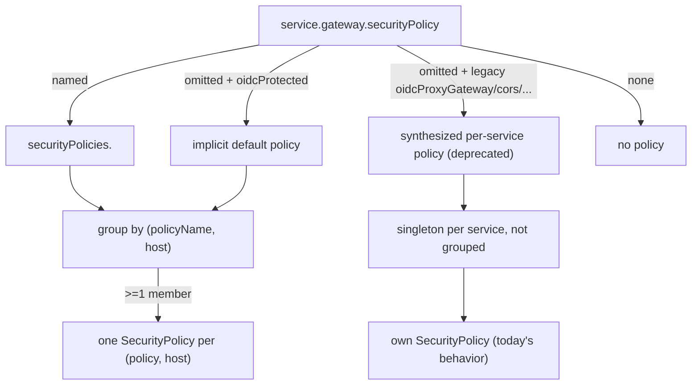

# Proposal: named SecurityPolicies

This is a design proposal for review. It is not implemented in this branch. It builds on the shared-session work in [PR #549](https://github.com/chanzuckerberg/argo-helm-charts/pull/549) and proposes replacing the automatic host-based grouping with named policies that services reference by name.

## Problem

A `SecurityPolicy` holds one `oidc`, `cors`, `ipAllowList`, `basicAuth` and `jwt` block, and an `HTTPRoute` can attach to only one `SecurityPolicy`. So any set of services that share a session must share one policy, and therefore one set of those settings. There is no per-path override inside a policy.

The current model derives which services share a policy automatically from their hostname, then reconciles their per-service settings after the fact. That reconciliation is where the sharp edges are. It takes annotations from one service and drops the rest, it suppresses a grouped service's `rules` and `-public` policies, and it fails the render when two services on one host want different OIDC providers, which is a configuration the old per-service model supported.

## Model

Move the policy settings out of each service into named policy definitions declared once, and have each service name the policy it wants. Every service pointing at the same policy becomes a `targetRef` on one object, so sharing is explicit and there is nothing to merge or clobber.

A policy is realized per hostname, because its `redirectURL` and OauthHMAC cookie are host-scoped. One named policy referenced by services on two hosts renders as two `SecurityPolicy` objects, one per host, each targeting that host's routes.

## New values surface

- A global-only `securityPolicies:` map, one entry per named policy, each carrying `oidc` (today's `oidcProxyGateway` fields), `basicAuth`, `jwt`, `cors`, `ipAllowList` and `annotations`. It is not under the `services` `$ref`, so it cannot be set per service.
- A `gateway.securityPolicy: ""` string on the service shape. Its value is a policy name, `default` or `none`.
- A built-in `default` policy is synthesized when `securityPolicies.default` is absent, using `argus-global-oidc`, issuer `https://czi.okta.com`, the current default scopes, `denyRedirect: true` and `logoutPath: /logout`. So `gateway.securityPolicy: default`, or omitting it with `oidcProtected: true`, is zero-config exactly as today.
- The per-service `oidcProxyGateway` block and `gateway.cors`/`ipAllowList`/`basicAuth`/`jwt` are marked deprecated. They keep working this change. Removal is a later major.

## Resolution and rendering

- `securityPolicy.definitions` returns the declared map with the implicit `default` merged in.
- `securityPolicy.resolve` returns a service's effective policy name and settings. Precedence: an explicit `gateway.securityPolicy` name, then `default` when `oidcProtected` is true and no legacy overrides are set, then a synthesized singleton built from the deprecated per-service fields, then none.
- `gateway.securityPolicy.body` is refactored to take a resolved policy dict instead of reading `oidcProxyGateway` and `gateway.cors`/`...` off the service. This is the core decoupling.
- The host-only grouping from PR #549 becomes grouping by `(policyName, host)`. Legacy synthesized policies are named per service, so they never group and unmigrated stacks render unchanged.
- Default cookie names for a grouped policy derive from `(policyName, host)`, not the primary service name, so the session is stable regardless of membership.

## What this fixes

- Two services on different policies on one host render two policies. The two-provider case works instead of failing.
- A grouped service keeps its `rules` and `-public` skipAuth policies, because only its main policy is rendered by the grouped template.
- Annotations come from the policy definition, so nothing is dropped.
- The config-equality failure is gone, because settings are centralized and there is nothing to disagree on.

## Migration

Existing stacks render unchanged, because the legacy fields resolve to a synthesized per-service policy. A stack opts into sharing by declaring `securityPolicies` and setting `gateway.securityPolicy` on the services that should share. A follow-up major removes the per-service surface and the ingress oauth2-proxy coupling.

## Open questions

- Policy object naming has to match existing names where possible to avoid delete and recreate churn on upgrade. The implicit-default single-service case should keep `<service>-oidc`.
- The ingress oauth2-proxy path stays on the legacy `oidcProxyGateway` fields for now. Named policies are gateway-only in this change.
